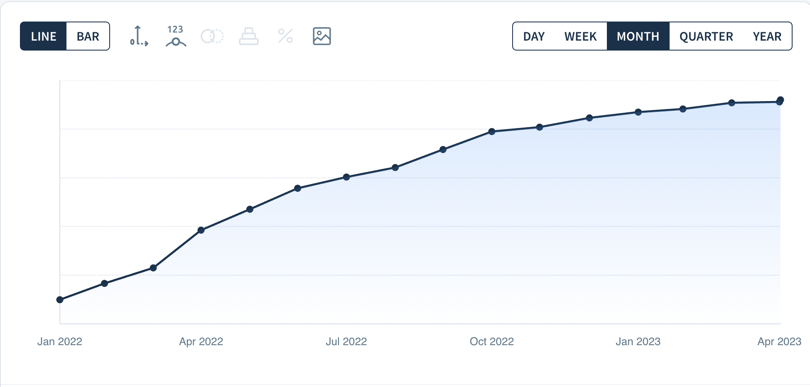
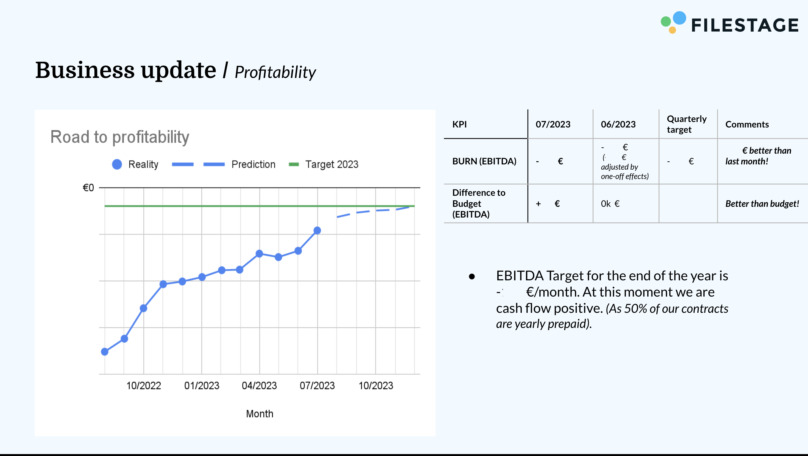

# Communicating Bad News With Clarity

Between November 2022 and May 2023, we had to let go of eight people from the
development department at Filestage: three in the first wave and five in the
second. In total, the department went from twenty-two people to fourteen.

I was part of the leadership team that made the decision, and I was responsible
for deciding what this meant for development. Some people had joined only a few
months before. One had been with us for six years, long before the 2021 and 2022
hiring spree and before our Series A investment. It was _one of the hardest
moments of my career_.

Growth had slowed down, the funding market had changed, and the plan that had
seemed reasonable during the SaaS boom was no longer safe. We first reduced
costs to create a more sustainable plan for 2023. A few months later, we had to
reduce costs again and reach profitability before we ran out of options.

**Layoffs are awful**. There is no inspiring way to tell people they are losing
their jobs. But if you ever have to communicate bad news, I hope this helps you
do it with honesty, clarity, and respect.

## The business reality

At the beginning of 2022, growth looked healthy. MRR was still increasing month
after month, but around the summer we started falling behind our targets. By
October 2022, the curve had flattened.

That was the tricky part: revenue did not collapse overnight. The line was still
going up, but our plan depended on **a growth curve that was no longer true**.

At the same time, the market changed. In 2021, SaaS companies were rewarded for
hypergrowth. By 2022, investors cared much more about efficiency and unit
economics. By 2023, profitability had become the priority.

On November 22, 2022, we started cutting costs. We reduced our 2023 growth
expectations from 100% year-over-year growth to 50%, set paid marketing to zero,
cut non-people costs wherever we could, and still had to let five people go
across development and sales, including three software engineers.

That first wave was painful, but we believed it would give the company a more
secure foundation for 2023. Growth did not recover enough. By May 2023, the
funding market was even harder, and profitability was no longer just a
responsible target. It was the only realistic path forward.

We also could not blame everything on the market. The top 25% of startups were
still growing over 100% year over year in 2023. As a leadership team, we had
made mistakes: we spread ourselves too thin across too many priorities, did not
align the whole company strongly enough around growth, and underestimated how
long product-led growth would take. We looked at our growth rates for validation
without deeply understanding whether we were outperforming the market or simply
growing with it.

That false confidence is dangerous. The question is not only _"are we growing?"_
but "are we growing faster than we should expect, given the market we are in?"
If you do not ask that second question, growth can make you feel safe while the
business is actually getting more fragile.

## What we tried before people

The CFO calculated the cost reduction we needed to make. **Before touching the
team**, we went through the rest of our costs and reduced everything we could.

Across both waves, we reviewed our tool stack and cancelled or downgraded tools
that were not essential. We reduced infrastructure costs, including moving away
from expensive services where we could. We reduced paid marketing spend. We
delayed company retreats. We froze compensation increases. The C-level team
reduced salaries. We also offered people the option to temporarily reduce their
working hours.

In the second wave, eight people outside the development department agreed to
reduce their hours until we reached break-even. I am still grateful for that. It
helped reduce the number of people who had to leave.

But it was still not enough. That is when we had to look at the team again. _It
still hurts to write that sentence._

## How we made the decision

This is the part that is hardest to write about.

In both waves, I had to look at the department through the lens of business
criticality for the company we needed to become: **smaller, profitable, and
focused on keeping the product operational**. Removing people from development
hurts more in the long term than in the short term, because product development
takes time to convert into revenue. But as long as we could keep the product
reliable and the team functional, it was the area where we could reduce costs
without immediately hurting revenue generation.

Thankfully, knowledge of our codebase and domain was well shared across the
team. I mainly attribute that to our culture of PR reviews, where everyone
reviewed code. That meant I did not have to keep people because of knowledge
hoarding. That made the decision simpler in one way and more painful in another.
It came down mostly to business-critical impact, performance, cost, and whether
a specialization was still affordable in the new operating model.

The hardest individual decision was letting go of someone who had worked with us
for six years. They had joined long before the hiring boom and long before our
Series A. Tenure and loyalty matter to me, but in that moment I had to be fair
to the strongest-performing team members.

That was brutal to accept. But if I had protected tenure over impact, I would
have sent the wrong message to the rest of the team. Fairness in a crisis cannot
only mean rewarding the people who have been there longest. It also has to mean
being honest about **the work the company needs now**, and who is best
positioned to do it.

Some of the decisions were especially painful because they involved specialists
who had already created a lot of value.

We had a strong DevOps engineer who had migrated our infrastructure to
infrastructure as code and helped set up our CI/CD pipeline so we could create
test environments for each pull request. That was a big transformation. But by
then, the bulk of that transformation was done, and other developers could
maintain what had been built. We could no longer afford to keep improving that
area at the same pace.

We had a QA engineer who had helped bring our automated tests to a point where
we had enough confidence to ship. Again, the work was valuable. But the
remaining team could maintain and extend the test suite from there.

Other decisions came down to the impact we could expect from each role relative
to its cost. That sounds cold, because it is cold. But when the company is
fighting for survival, leadership has to make decisions based on the operating
model the company can afford, not the operating model everyone wishes they still
had.

The important thing is that **"not affordable anymore" does not mean "not
valuable."** Someone can do valuable work and still be part of a cost structure
the company can no longer sustain. Both things can be true at the same time.

## The announcement

We communicated both waves with as much honesty and context as we could.

Because Filestage is a fully remote company, the company-wide announcements were
prerecorded videos from the CEO. We shared those videos only after the
one-on-one meetings with the people affected were done. That order mattered. The
people losing their jobs deserved to hear it directly before anyone else. At the
same time, the rest of the company needed to get the news quickly, with the same
context, before gossip and panic filled the gap.

In November 2022, the CEO explained that the global economy was volatile, that
inflation and interest rates were rising, that startup funding had changed, and
that we were behind our growth targets. We had originally planned for much
faster growth in 2023, but that budget was now too optimistic. The first cost
cut was meant to create a more sustainable foundation.

In May 2023, the message had become even harder. The CEO announced that the
company had to reduce costs again, that growth had slowed further, that the
funding market had become even more difficult, and that our path forward was to
reach profitability. He also took responsibility clearly. The message was not
"these people failed." The message was that management had made assumptions and
strategic decisions that did not work as expected.

That distinction matters.

When people lose their jobs because of a business decision, **do not hide behind
vague language. Do not call it "rightsizing." Do not suggest it is a performance
issue if it is not.** Do not over-explain to make yourself feel better. Say what
happened, why it happened, what you tried before this, and what will happen
next.

In a moment like this, people do not need motivational language. They need
**truth, acknowledgment, and a reasonable plan**.

## Supporting the people who left

We tried to prove **kindness through actions, not only words**.

The people who left received a severance package. They could keep their
hardware. We wrote recommendation letters, offered to review CVs, acted as
references, and used our personal networks to help them find new jobs.

We also gave people time to say goodbye. We kept in touch with the people who
left. I was genuinely worried for them, because many companies were also laying
people off at the time, which made finding a new job harder.

None of that removes the pain of losing a job. But when you have to make a
painful decision, the minimum responsibility is to **help people land as well as
possible**.

## Communicating with the remaining team

After layoffs, the remaining team has a different set of fears.

_Am I next? Is the company dying? Can I still trust leadership? Are we expected
to do the same amount of work with fewer people?_

You need to answer those questions directly.

The company was in danger. That is why we had to make the cuts. Across both
waves, development went from twenty-two people to fourteen. That was a 36%
reduction. In the second wave, eight people across the rest of the company also
reduced their hours. But after the cost reduction, we had a realistic chance of
reaching profitability and no longer depending on investors.

I was clear with the team that we were **not going to do the same amount of work
with fewer people**. Feature development would slow down. Our priority was to
keep the product operational, reliable, and maintainable while the company moved
toward profitability.

This was one of the most important parts of the communication. If you reduce a
team and then pretend nothing changed, people will burn out or stop trusting
you. **A smaller team needs a smaller scope.**

So we had a meeting to redistribute the responsibilities of the people who left.
Everyone needed to know who owned what. We also explained what we would stop
doing.

For example, we moved further improvements to our infrastructure as code into
maintenance mode. We stopped proactively adding end-to-end tests for legacy
code. Instead, we added them reactively when fixing bugs or building new
features. We reduced expectations around the speed of new feature development.

Leadership in this kind of moment is mostly subtraction. You have to decide what
no longer gets done. Otherwise, the work does not disappear, it just becomes
pressure on the people who stayed.

## Rebuilding trust

You cannot ask people to simply trust you again after layoffs. Trust has to be
earned again through **consistent transparency**. And yes, it is slower than you
would like.

We shared more financial context with the company. We explained our target for
profitability and showed how we were progressing toward it. As the months went
by, people could see whether the plan was working.

I also had regular one-on-ones with everyone on the team. Those conversations
were important. People had anxieties, questions, and doubts. I tried to answer
with **facts, not false reassurance**.

I also took more work on myself to avoid burning out the team. That was not a
perfect or sustainable long-term strategy, but in the short term I felt it was
my responsibility. The team had already absorbed a huge emotional shock. I did
not want the next message to be: "now do the same work with fewer people."

In the end, no one else left the development team after the layoffs. We retained
the key people. Satisfaction in engineering stayed high, above 90 in our
internal surveys. Feature throughput went down, as expected, but we managed to
keep the product running and the company reached profitability.

That does not make the layoff day a success. It only means the painful decision
achieved what it was meant to protect.

## What I would do differently

I have reflected a lot on the actions that led us there.

During the SaaS boom, everyone received funding and hired at the same time. That
made it extremely hard to hire talent. Recruiting required a lot of interviews,
a lot of filtering, and higher compensation. Then the market changed. Suddenly,
there was a lot of great talent available, but companies no longer had money to
hire.

Looking back, I think it would have been wiser to hire at a slower and steadier
rate, almost like a dollar-cost averaging strategy. Instead of trying to hire so
much during peak demand, we could have reduced the risk of building the team at
the most expensive moment in the market.

I also think we did not understand our growth deeply enough. We were growing a
lot, but we did not compare our growth to the average market growth. That gave
us false confidence. **Growth can become a vanity metric** if you do not
understand why it is happening.

The painful lesson is that a company can make decisions that look rational in
one market and become dangerous in another. When the environment changes, the
**assumptions behind your plan matter more than the plan itself**.

## What I learned about communicating bad news

Communicating bad news well is not about finding perfect words. _There are no
perfect words_ for telling people they are losing their jobs.

What matters is whether your words are backed by **facts, responsibility, humane
actions, and a credible operating plan**.

Be honest about the situation. Share the numbers people need to understand the
decision. Take responsibility for the mistakes that led there. Do not create
false hope. Do not blame the people who are leaving. Help them as much as you
can. Then be equally honest with the people who remain about what changes next.

The announcement is only one moment. **Trust is built or broken by what you do
before and after it.**
