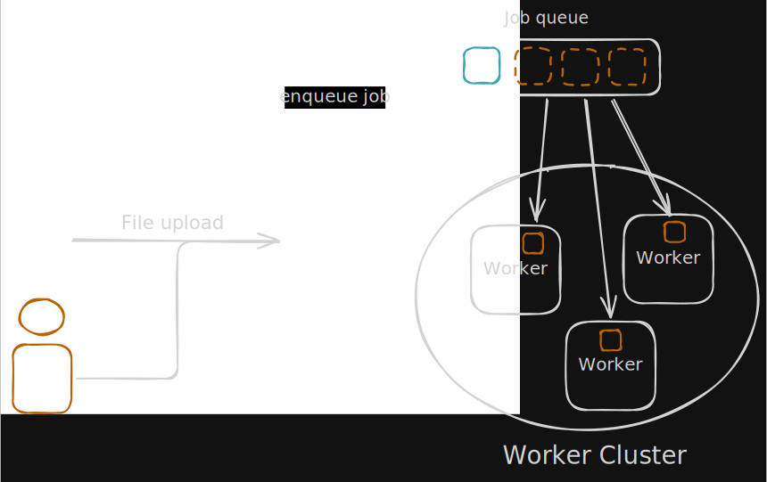
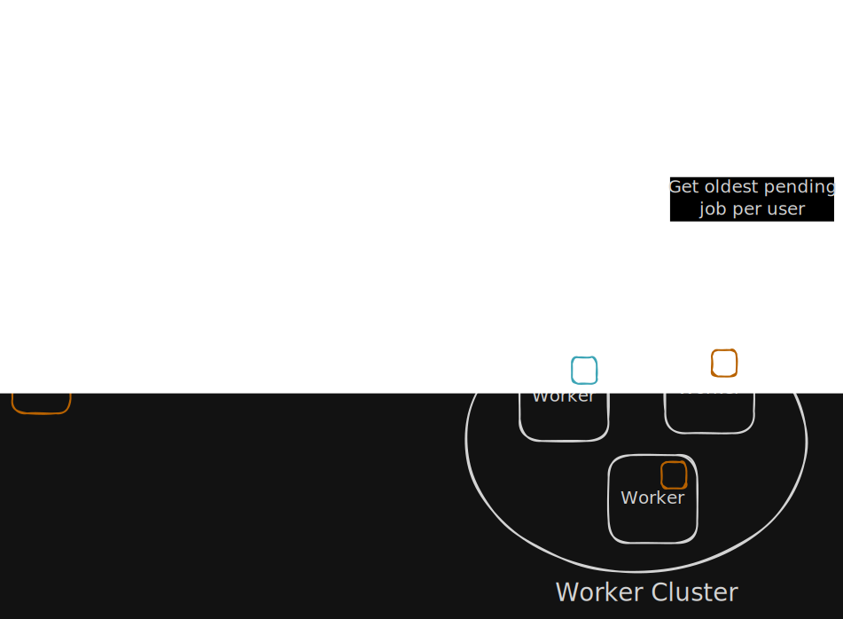
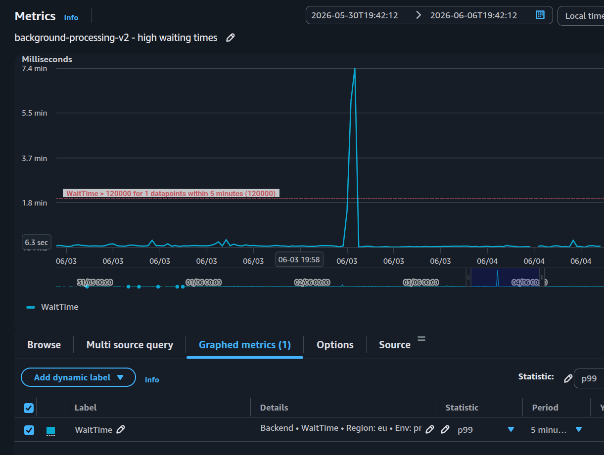

# Scaling background file processing without blocking everyone else

At [Filestage](https://www.filestage.io/) users upload files to get them
reviewed, and it is common for them to upload many files at once. Processing
files to make them web compatible takes a lot of compute, especially high
quality video. That is why our background processing cluster autoscales based on
demand.

## The problem was fairness, not raw throughput

From time to time, users complained that files were taking too long to be
processed. We had spikes in queue wait time. Our setup was pretty simple. Every
time a user uploaded a file, we pushed the job into an
[AWS SQS](https://aws.amazon.com/sqs/) queue. Our background processing cluster
autoscaled based on the queue size. So if there were too few workers, we would
provision more, which gave us an efficient use of resources. The problem is that
it takes several minutes for the autoscaling to notice there are too many jobs,
provision new instances, and have them ready to process jobs.

We started looking carefully at the episodes in which our queue wait alarms
triggered and correlated them with our logs. We identified that sometimes users
uploaded thousands of files at once. With one shared queue, the system behaved
like a global first-come-first-served backlog: one large upload batch could
monopolize worker attention, and other customers who uploaded a few seconds
later would wait far too long for a single file to be processed.



## Simple queue implementation

We started with a pretty simple approach, the API pushes the job into the SQS
queue. Workers receive one message, run the handler, report metrics, delete the
message, and wait for the next one.

```js
const sqsClient = new SQSClient({});

let isPolling = false;

/**
 * Enqueue a job from the API.
 *
 * @param {string} handler path to the handler function
 * @param {Object} args
 */
exports.launch = async function (handler, args) {
  await sqsClient.send(
    new SendMessageCommand({
      QueueUrl: env.AWS_SQS_QUEUE,
      MessageBody: JSON.stringify({ handler, args }),
    }),
  );
  logger.info(TAG, `launched job`, { handler, args });
};

/**
 * Process pending jobs.
 */
exports.start = async function () {
  isPolling = true;
  logger.info(TAG, "started processing job");

  while (isPolling) {
    const message = await receiveMessage();
    if (message) {
      const { job, sentEpoch, waitTimeMs, ReceiptHandle } = message;
      await sendWaitTimeMetrics(job.handler, waitTimeMs);

      const startEpoch = Date.now();
      logger.info(TAG, "processing job", { job, waitTimeMs });
      try {
        await require(job.handler)(job.args);
        logger.info(TAG, "processed job", {
          job,
          waitTimeMs,
          elapsedMs: Date.now() - startEpoch,
        });
      } catch (error) {
        logger.error(TAG, "failed to process job", {
          job,
          error,
          elapsedMs: Date.now() - startEpoch,
        });
      } finally {
        await sqsClient.send(
          new DeleteMessageCommand({
            QueueUrl: env.AWS_SQS_QUEUE,
            ReceiptHandle,
          }),
        );
        await sendElapsedTimeMetrics(job.handler, startEpoch, sentEpoch);
      }
    }
  }

  logger.info(TAG, "stopped processing job");
};

async function receiveMessage() {
  const { Messages } = await sqsClient.send(
    new ReceiveMessageCommand({
      QueueUrl: env.AWS_SQS_QUEUE,
      MaxNumberOfMessages: 1,
      WaitTimeSeconds: 20,
      AttributeNames: ["SentTimestamp"],
    }),
  );
  if (Messages && Messages.length > 0) {
    const message = Messages[0];
    const { handler, args } = JSON.parse(message.Body);
    const sentEpoch = Number(message.Attributes.SentTimestamp);
    const waitTimeMs = Date.now() - sentEpoch;
    return {
      job: { handler, args },
      sentEpoch,
      waitTimeMs,
      ReceiptHandle: message.ReceiptHandle,
    };
  }
}

exports.stop = function () {
  isPolling = false;
  logger.info(TAG, "stopping job processing");
};
```

There is a lot to like about this. The code is short. SQS is reliable.
[AWS ECS](https://aws.amazon.com/ecs/) Fargate workers are easy to scale
horizontally based on the SQS queue size.

## The design: one logical queue per user

We thought of different ways to fix this problem. First we looked into
optimizing our infrastructure to make provisioning of new workers faster, but if
we were still going to rely on AWS ECS Fargate it wasn't realistic to get that
down to a few seconds. Then we thought of overprovisioning our background
processing cluster or using machine learning to predict the usage pattern. This
would make our cluster resources more closely match demand, but still would not
properly deal with sudden spikes, which was the problem we were actually facing.

Then I put myself in the shoes of the actual user of our app. When you upload
thousands of files, you do not expect all of them to be processed immediately.
So I took advantage of that. If we grouped jobs per user, users who uploaded
thousands of files at once would have to wait longer, but in return the rest of
the users of the application would not notice the performance drop.



## Per user queue implementation

SQS stands for _Simple_ Queue Service, and the setup we had did not give us the
per-user scheduling behavior we wanted. Today,
[SQS fair queues](https://docs.aws.amazon.com/AWSSimpleQueueService/latest/SQSDeveloperGuide/sqs-fair-queues.html)
are also worth considering for this kind of noisy-neighbor problem. In our case,
we wanted explicit scheduling control and persisted job state that we could
inspect and modify.

I looked into other more advanced queues like
[RabbitMQ](https://www.rabbitmq.com/) but to keep the infrastructure overhead
low I decided to start with our already existing
[MongoDB](https://www.mongodb.com/) database.

I designed a custom queue in MongoDB. Instead of treating the backlog as one
flat list of jobs, every job carried a `userId`. Workers would pick jobs in a
round-robin style across users.

The goal was simple:

- If one user uploads thousands of files, they should still get processed.
- If another user uploads one file during that spike, they should not wait
  behind the entire batch.
- If only one user has work left, the system should use all available worker
  capacity for that user.

That last point is important. Fairness should not mean artificially slowing the
pipeline down when there is no contention.

In practice, each background job had this shape:

```typescript
type JobBase = {
  _id: ObjectId;
  userId: ObjectId;
  handler: string;
  args: unknown;
  createdAt: Date;
};

type Job =
  | (JobBase & { status: "PENDING" })
  | (JobBase & { status: "PROCESSING"; startedAt: Date })
  | (JobBase & {
      status: "COMPLETED";
      startedAt: Date;
      finishedAt: Date;
      result: unknown;
    })
  | (JobBase & {
      status: "FAILED";
      startedAt: Date;
      finishedAt: Date;
      error: Error | ErrorFromSerialized;
    });
```

The implementation was similar. The API inserts a document in the MongoDB
collection. Workers fetch the next document to process, update it to
`PROCESSING`, run the handler, report metrics, update it to `COMPLETED`, and
wait for the next one.

```js
let isPolling = false;
let processing;
let jobsCollection;

exports.initialize = async function () {
  jobsCollection = await mongodb.collection("backgroundJobs");
};

/**
 * Enqueue a job from the API.
 *
 * @param {Id} userId
 * @param {string} handler path to the handler function
 * @param {Object} args
 * @returns {Promise<Job>}
 */
exports.launch = async function (userId, handler, args) {
  const job = JobSchema.parse({
    userId,
    _id: new ObjectId(),
    handler,
    args,
    status: "PENDING",
    createdAt: new Date(),
  });
  await jobsCollection.insertOne(job);
  await sendPendingJobsMetric();
  logger.info(TAG, `queued job`, { job });
  return job;
};

/**
 * Process pending jobs.
 */
exports.start = function () {
  processing = (async () => {
    isPolling = true;
    await sendPendingJobsMetric();
    logger.info(TAG, "started processing jobs");
    while (isPolling) {
      let job = await nextJob();
      if (!job) {
        logger.debug(TAG, "no pending jobs found");
        await new Promise((resolve) =>
          setTimeout(resolve, env.BACKGROUND_PROCESSING_POLLING_INTERVAL),
        );
        continue;
      }

      logger.info(TAG, "processing job", { job });
      await sendJobWaitTimeMetric(job);
      try {
        const result = await require(job.handler)(job.args);
        job = JobSchema.parse(
          await jobsCollection.findOneAndUpdate(
            { _id: job._id },
            {
              $set: {
                status: "COMPLETED",
                result,
                finishedAt: new Date(),
              },
            },
            { returnDocument: "after" },
          ),
        );
        await sendJobProcessTimeMetrics(job);
        logger.info(TAG, "processed job", { job });
      } catch (error) {
        job = JobSchema.parse(
          await jobsCollection.findOneAndUpdate(
            { _id: job._id },
            {
              $set: {
                status: "FAILED",
                error: errors.serialize(error),
                finishedAt: new Date(),
              },
            },
            { returnDocument: "after" },
          ),
        );
        logger.error(TAG, "failed to process job", { job });
      }
    }
    logger.info(TAG, "stopped processing jobs");
  })();
};

exports.stop = async function () {
  logger.info(TAG, "stopping job processing");
  isPolling = false;
  await processing;
};
```

When a worker asks for the next job, it does not simply take the oldest pending
job globally. It first finds the oldest pending job per user, then chooses the
user whose last started job is oldest.

```js
async function fetchNextPendingJob() {
  const cursor = jobsCollection.aggregate([
    // Fetch oldest pending job per user
    {
      $match: { status: "PENDING" },
    },
    { $sort: { createdAt: 1, _id: 1 } },
    {
      $group: {
        _id: "$userId",
        jobId: { $first: "$_id" },
        createdAt: { $first: "$createdAt" },
      },
    },
    // Lookup last started job for each user
    {
      $lookup: {
        from: "backgroundJobs",
        let: { userId: "$_id" },
        pipeline: [
          {
            $match: {
              $expr: {
                $and: [
                  { $eq: ["$userId", "$$userId"] },
                  { $ne: ["$status", "PENDING"] },
                ],
              },
            },
          },
          {
            $group: {
              _id: null,
              latestStartedAt: { $max: "$startedAt" },
            },
          },
        ],
        as: "activity",
      },
    },
    {
      $addFields: {
        latestStartedAt: { $arrayElemAt: ["$activity.latestStartedAt", 0] },
      },
    },
    // Select the job for the user whose last turn was longest ago, then break ties deterministically.
    { $sort: { latestStartedAt: 1, createdAt: 1, _id: 1 } },
    { $limit: 1 },
    {
      $project: {
        _id: "$jobId",
        userId: "$_id",
        createdAt: 1,
        latestStartedAt: 1,
      },
    },
  ]);
  return cursor.next();
}
```

Then we have to make sure we avoid race conditions. For that, we try to update
the next job only if it is still `PENDING`. Two workers may race and select the
same pending job, but only one of them can successfully move it from `PENDING`
to `PROCESSING`. The loser simply tries again.

```js
/**
 * Fetches the next job to process from the queue.

 * @returns {Promise<Job | undefined>}
 */
async function nextJob() {
  const nextJob = await fetchNextPendingJob();
  if (!nextJob) {
    logger.debug(TAG, "no pending jobs found");
    return;
  }
  logger.debug(TAG, "next job to process", { nextJob });

  const claimedJob = await jobsCollection.findOneAndUpdate(
    {
      _id: nextJob._id,
      status: "PENDING",
    },
    {
      $set: { status: "PROCESSING", startedAt: new Date() },
    },
    { returnDocument: "after" },
  );
  if (claimedJob) {
    logger.debug(TAG, "claimed job for processing", { claimedJob });
    return JobSchema.parse(claimedJob);
  }
  logger.debug(TAG, "job already claimed by another worker", { nextJob });
}
```

## What changed in the user experience

The difference was immediate because the pipeline stopped being dominated by the
largest batches of uploads from single users.



With the old queue, we could see wait time spikes when a big customer batch
landed at the wrong moment. The overall p99 did not magically become perfect. It
still tends to sit around 3 seconds because large files and large batches still
exist. The important change was that one customer flooding the queue no longer
made everyone else feel the pain. Other users could continue to upload a small
number of files and see low queue wait time, so the complaints stopped.

Today, this pipeline processes roughly 800,000 file uploads and 6TB of storage
per month.

## Queue observability

If jobs eventually finish, it can look healthy from the outside, even if users
are waiting too long. That is why we tracked separate metrics.

If `ProcessTime` is high, the handler is expensive. Maybe video transcoding is
slow, maybe a converter is misbehaving, or maybe the file is just huge. If
`WaitTime` is high, the queueing policy or worker capacity is the problem.
Splitting those two concepts kept the debugging concrete.

Speaking of debugging, a nice advantage of using MongoDB is that the history and
status of the queue are easy to inspect. That allows us to check and modify the
queue in case of problems.

## Why not just use priority queues?

Priority queues can help, but they were not the main shape of the problem.

We did not want to say that some customers were always more important than
others. We wanted to prevent any single customer from consuming the whole
pipeline during bursts.

A priority system can also become a political problem very quickly: Which
customer gets priority? Which file type? Which plan? What happens when a large
enterprise customer uploads a huge batch while another large enterprise customer
uploads one urgent file?

Fair scheduling was a cleaner default. It encoded a product principle directly
into the system: under contention, every active customer should keep making
progress.

## Why MongoDB was good enough here

I'm not encouraging you to build your own queues on top of your database, but in
our case the amount of messages meant it wouldn't add any significant load to
our database and we already used MongoDB heavily.

The job documents were easy to inspect. The scheduler logic could be expressed
within the database using an aggregation pipeline without having to spin up a
scheduler service. Atomic updates were enough to claim jobs safely across
workers. We could keep the operational model simple while adding the scheduling
behavior we actually needed.

## What I would keep in mind next time

The biggest lesson is that scalability problems are often product experience
problems in disguise.

From an infrastructure perspective, a queue with a growing backlog is normal.
From a user's perspective, uploading one file and waiting minutes because
someone else uploaded thousands feels broken.

I would also watch fairness earlier. A system can have plenty of total capacity
and still feel unreliable if the work is scheduled poorly. Average wait time can
look fine while p99 is painful. Total throughput can improve while individual
users still get stuck behind noisy neighbors.
